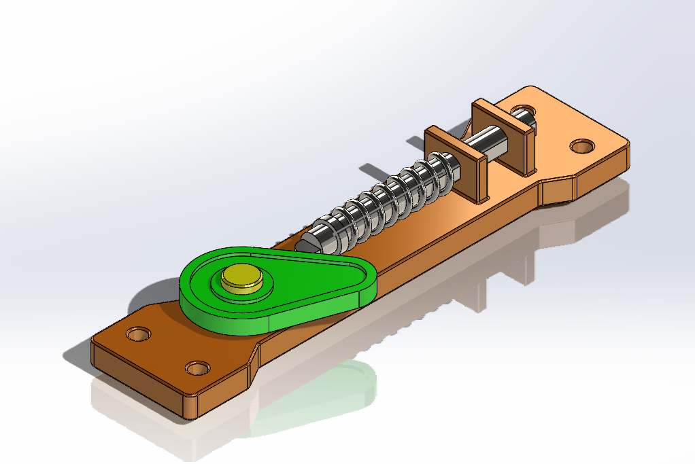
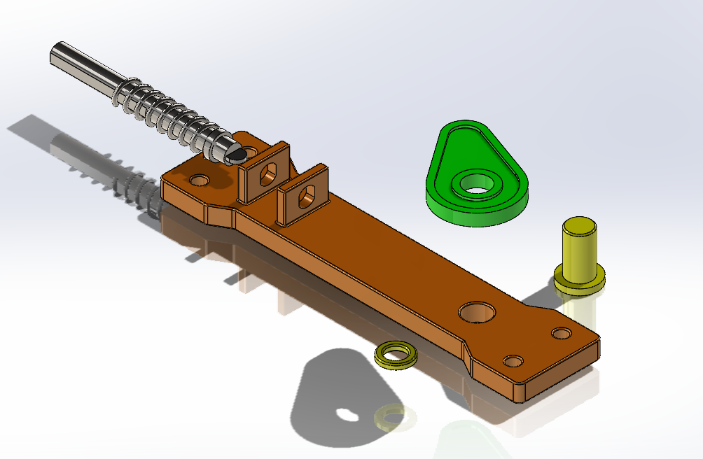
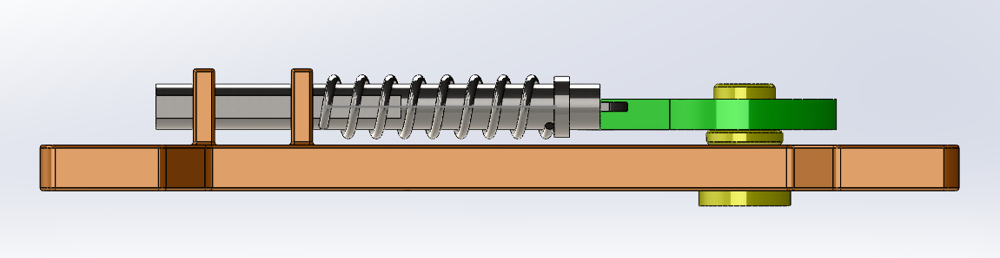
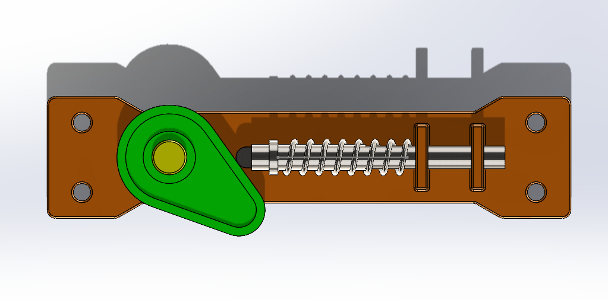

# Cam-and-Spring-Mechanism
Cam and spring mechanism modeled and assembled in SOLIDWORKS for mechanical CAD practice.
# ⚙️ Cam and Spring Mechanism | SolidWorks

> **Mechanical CAD • Assembly Design • Mechanism Modeling**

A 3D CAD model of a **cam and spring mechanism** designed and assembled in **SOLIDWORKS** as part of my mechanical design and CAD practice.

---

## 🔧 Project Overview

This project focuses on the **3D modeling and assembly of a cam-driven spring mechanism**.

Individual components were modeled in SOLIDWORKS and assembled to create the complete mechanical system. The project was used to practice component modeling, assembly relationships, and visualization of mechanical mechanisms.

### 🎯 Design Focus

* Mechanical component modeling
* Assembly design
* Cam mechanism arrangement
* Spring integration
* Component relationships
* Exploded-view visualization

---

## 🖼️ Project Gallery

### Isometric View



### Exploded View



> The exploded view illustrates the arrangement of the major components within the assembly.

### Side View



### Top View



## 🎥 Mechanism Video

A short video demonstrating the assembled cam and spring mechanism.

[▶️ Watch the Cam and Spring Mechanism](cam%20and%20follower.mp4)

---

---

## 🧩 Main Components

| Component            | Purpose                                       |
| -------------------- | --------------------------------------------- |
| **Cam**              | Provides the primary rotating profile         |
| **Spring**           | Provides restoring force within the mechanism |
| **Shaft**            | Supports the rotating cam                     |
| **Base Plate**       | Supports the mechanism                        |
| **Support Brackets** | Holds the shaft and related components        |

---

## 🛠️ Skills Demonstrated

**CAD Modeling**

* 3D Part Modeling
* Mechanical Component Design
* Feature-Based Modeling

**Assembly**

* Assembly Design
* Assembly Mates
* Component Positioning
* Exploded Views

**Engineering Visualization**

* Isometric Views
* Orthographic Views
* Assembly Presentation

---

## 💻 Software

**SOLIDWORKS**

---

## 📁 Repository Contents

```text
Cam-and-Spring-Mechanism/
│
├── README.md
│
├── *.SLDASM
├── *.SLDPRT
│
├── Isometric-view.png
├── Exploded-view.png
├── Side-view.png
└── Top-view.png
```

---

## 🎯 Project Objective

The objective of this project was to strengthen practical skills in **mechanical CAD and assembly design** by developing individual components and integrating them into a complete cam and spring mechanism.

---

## 👤 Author

**Barun Gautam**

Mechanical Engineering Student

**Interests:** Mechanical Design · CAD · Engineering Simulation
